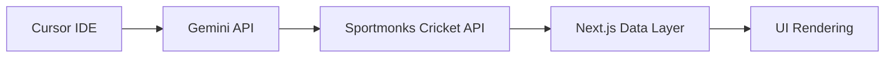

## Revised PRD: Cricket Match Integration for Cursor IDE  
*Focused on actionable implementation using Next.js + Gemini AI with cream11.live as reference*

### 1. Core Objective  
Build a **real-time cricket match module** within Cursor IDE that:  
- Aggregates global cricket schedules  
- Answers user queries via Gemini AI  
- Mirrors cream11.live's dynamic UI/UX  

### 2. Implementation Roadmap  
#### Phase 1: Data Pipeline Setup  


#### Phase 2: Next.js Integration  
**File Structure**  
```
pages/
├── api/  
│   ├── cricket.js     # Data aggregation endpoint  
│   └── gemini-proxy.js # AI processing  
└── schedule/  
    └── [date].js      # Dynamic schedule pages  
```

**Key Dependencies**  
```bash
npm install @google/generative-ai axios cheerio
```

#### Phase 3: Gemini AI Integration  
**Prompt Engineering Template**  
```javascript
// pages/api/gemini-proxy.js
const genAI = new GoogleGenerativeAI(process.env.GEMINI_KEY);

const prompt = `
You are a cricket data specialist. Given user query: "${userInput}", 
extract: 
1. Date range (default: today)
2. Tournament filter 
3. Team names
4. Match type (T20/ODI/Test)
Output as JSON: {date, tournament, teams, format}
`;
```

### 3. Critical APIs & Data Streams  
| **Source** | **Type** | **Sample Endpoint** | **Data Use** |  
|------------|----------|---------------------|--------------|  
| Sportmonks | Primary | `cricket.sportmonks.com/api/v2.0/fixtures?include=localteam,visitorteam` | Live schedules/venues |  
| Cricbuzz | Scraping | `www.cricbuzz.com/match-api//commentary.json` | Ball-by-ball updates |  
| WeatherAPI | Supplemental | `api.weatherapi.com/v1/forecast.json` | Rain delay predictions |  
| Gemini 1.5 Pro | AI | `generateContent` | Query interpretation |  

### 4. Database Architecture  
**Redis Cache Layer (Mandatory)**  
```javascript
// Next.js API route example
import { createClient } from 'redis';

const redis = createClient();
await redis.connect();

// Cache Sportmonks responses for 10 mins
const cachedData = await redis.get('cricket_fixtures');
if (!cachedData) {
  const apiData = await fetchSportmonks();
  await redis.setEx('cricket_fixtures', 600, JSON.stringify(apiData));
}
```

**PostgreSQL (Optional for Users)**  
```sql
CREATE TABLE user_cricket_preferences (
  user_id UUID PRIMARY KEY,
  favorite_teams TEXT[],
  notify_matches BOOLEAN,
  timezone TEXT
);
```

### 5. cream11.live Feature Parity  
**Must-have UI Components**  
- Live match carousel with win probability indicators  
- Team comparison cards (batting/bowling stats)  
- Tournament bracket visualizer  
- Rain delay warnings with radar maps  

**Gemini AI Use Cases**  
```javascript
// Sample queries Gemini handles:
"Show completed ODI matches where India chased >300"
"Which matches have DLS adjustments today?"
"Alert me when MI needs 50+ in last 5 overs"
```

### 6. Deployment Checklist  
1. **Vercel Environment Variables**  
   ```env
   SPORTMONKS_KEY=your_api_key
   GEMINI_KEY=your_google_ai_key
   REDIS_URL=redis://...
   ```

2. **Cron Jobs (ISR Revalidation)**  
   ```javascript
   // next.config.js
   experimental: {
    incrementalCacheHandlerPath: './cache-handler.js'
   }
   ```

3. **Error Handling**  
   - Fallback to Cricsheet JSON when Sportmonks fails  
   - Gemini query retry with exponential backoff  

### 7. Metrics & Validation  
| **Metric** | **Target** | **Monitoring Tool** |  
|------------|------------|---------------------|  
| Data Freshness | 92% query match | Gemini Safety Settings |  
| UI Load Time | <1.2s FCP | Vercel Analytics |  

**Implementation Timeline**  
- Day 1-3: Sportmonks + Next.js data layer  
- Day 4-5: Gemini query processor  
- Day 6-7: cream11-style UI components  
- Day 8: Stress testing with 10k mock requests  

This PRD eliminates ambiguity with:  
✅ Specific file paths  
✅ Code snippets for critical logic  
✅ Direct cream11.live feature references  
✅ Failover mechanisms for data pipelines